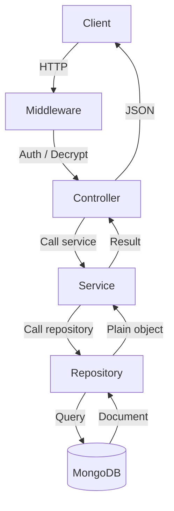
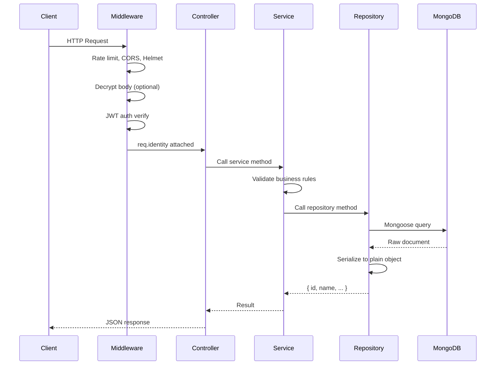
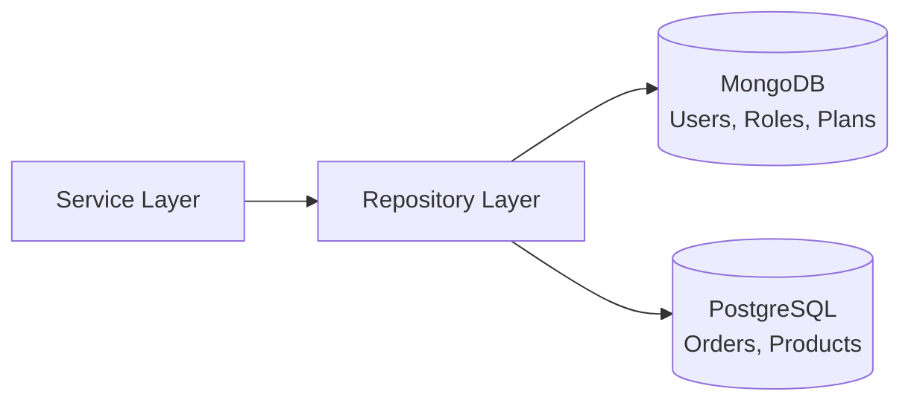

# create-project

A CLI tool that scaffolds a **full-stack project** — pick from **API (Express + MongoDB with Repository Pattern)**, **Frontend (React + Vite)**, or **Admin Panel (React + Vite)** — all in one command. Features JWT authentication, hybrid encryption (RSA+AES-GCM or AES-CBC), user & role management, and optional GitHub push.

## 🌟 Why This Stands Out

| Feature | What makes it different |
|---------|------------------------|
| **Defense-in-depth security** | Rate limiting (per-IP), strict CORS, Helmet headers, payload size limits — not just JWT |
| **Zero key files on disk** | RSA keypair auto-generated and stored directly in `.env` — no `keys/` directory to leak |
| **Hybrid encryption, zero config** | RSA+AES-GCM or AES-CBC — toggle with one env var. Keys auto-generate on first run |
| **Secret auto-injection** | Run with `CRYPTO_SECURE_ENCRYPTION=true` and missing keys? The server generates them and writes to `.env` for you |
| **Dev-safe rate limiting** | Rate limits automatically disable when `NODE_ENV=development` — no Postman friction |
| **Production-hardened logging** | `combined` format in prod, `dev` format in development — no sensitive data leaked to logs |
| **Conditional seeding** | Default roles and admin user only seed when `RUN_SEED=true` is set. Admin credentials configurable via `.env` |
| **CORS deny-by-default** | If `CORS_ORIGIN` is not set, all cross-origin requests are denied — safe fallback |
| **Stateless JWT Bearer auth** | No cookies, no CSRF surface — immune to CSRF attacks by design |
| **End-to-end encryption** | Frontend encrypts before sending, server decrypts on arrival. Not just transport-level TLS |
| **Repository Pattern** | All database logic isolated behind a repository layer — swap MongoDB for PostgreSQL without touching services |

## Usage

```bash
npx @vineet1576/create-project my-app
```

Or install globally:

```bash
npm install -g @vineet1576/create-project
create-project my-app
```

## Interactive Selection

Pick a single platform using arrow keys:

```
? Select a platform to create:
❯ API (Backend)
  Frontend (React + Vite)
  Admin Panel (React + Vite)
```

Based on your choice, the CLI adapts the prompts:

| Platform | Prompts shown |
|----------|-------|
| **API** | .env config (DB, JWT, SMTP), encryption mode, Git, GitHub |
| **Frontend** | Git, GitHub (no DB/JWT prompts) |
| **Admin Panel** | Git, GitHub (no DB/JWT prompts) |

## What You Get

### API (Express + MongoDB)

- **Repository Pattern** — All database logic in `repositories/` layer. Services never touch ORMs.
- **Polyglot-ready** — Add PostgreSQL or any other database without changing existing services.
- **JWT auth** — Register, login (user/admin), auto-login, logout
- **User module** — Profile, password management, forgot/reset password, email verification
- **Single-use verification links** — New users receive an encrypted "Verify & Login" link (one-time use, 24h expiry). No plaintext passwords in emails.
- **Admin user management** — Paginated listing, search, filter, CRUD, status/approval
- **Role module** — Create, update, list, delete roles
- **Encryption** — Crypto-secure (RSA+AES-GCM) or legacy (AES-CBC), env-configurable
- **Email** — Nodemailer with SMTP, ready-to-use HTML templates
- **Security** — Rate limiting, CORS (deny-by-default), Helmet, bcrypt, JWT, payload limits

### Frontend (React + Vite)
- Login, Register, Email Verification, Forgot/Reset Password
- Profile management
- Auto-detects encryption mode (crypto-secure or legacy)
- Axios interceptors for transparent encryption

### Admin Panel (React + Vite)
- Admin login, Dashboard with user stats
- User management (list, add, edit, delete)
- Role management (list, add, edit, delete)
- Sidebar navigation, DataTable, Modal components
- Auto-detects encryption mode

## Security Architecture

### Rate Limiting (Per-IP)
| Endpoint type | Limit | Dev mode |
|---------------|-------|----------|
| Auth (`/login`, `/register`, etc.) | 15 requests/minute | Disabled |
| General (all other routes) | 100 requests/minute | Disabled |

Limits apply per-IP. 100 users from 100 different IPs can each hit login 15 times per minute.

### CORS
- `CORS_ORIGIN` must be explicitly set in production
- **No wildcard fallback** — if unset, all cross-origin requests are denied
- Supports multiple origins via comma: `https://site1.com,https://site2.com`

### Payload Limits
| Content type | Limit | Why |
|-------------|-------|-----|
| JSON | 5MB | Accommodates base64 image uploads |
| URL-encoded | 50MB | Handles encryption overhead (encrypted payloads can be ~2x larger) |

### Key Management
- RSA keypair is **never stored in a file on disk**
- Auto-generated on first run and written directly to `.env`
- Both private and public keys live exclusively in environment variables
- Legacy mode uses a shared `SECRET_KEY` and `ENCRYPTION_IV` from `.env`

### Logging
- **Production**: `combined` format (Apache-standard, no sensitive data)
- **Development**: `dev` format (colored, detailed for debugging)

## Encryption Options

| Mode | Algorithm | Key storage | Auto-generate |
|------|-----------|-------------|---------------|
| **crypto-secure** (`CRYPTO_SECURE_ENCRYPTION=true`) | RSA-2048 OAEP + AES-256-GCM | `.env` vars | ✅ First run writes keys to `.env` |
| **Legacy** (`CRYPTO_SECURE_ENCRYPTION=false`) | AES-CBC with shared secret | `.env` vars | ❌ Must set manually |

When crypto-secure is enabled, the server automatically generates RSA keys on first run and exposes `/.well-known/encryption-key`. Frontend/admin clients auto-detect the mode and handle encryption transparently via Axios interceptors.

## Architecture — Repository Pattern

All database logic is isolated behind a **repository layer**. Services never touch ORMs or queries directly. Every repository method returns a **plain JavaScript object** with string IDs — never a Mongoose document.

```js
// Repository output — always a plain object
{ id: "abc123", name: "admin", status: "active" }
```

### Architecture Overview



### Request Flow



### Services & Repositories Map

| Service | Repository | Database |
|---------|-----------|----------|
| `userService.js` | `userRepository.js` | MongoDB |
| `roleService.js` | `roleRepository.js` | MongoDB |
| `categoryService.js` | `categoryRepository.js` | MongoDB |
| `contactUsService.js` | `contactUsRepository.js` | MongoDB |
| `contentManagementService.js` | `contentManagementRepository.js` | MongoDB |
| `featureService.js` | `featureRepository.js` | MongoDB |
| `planService.js` | `planRepository.js` | MongoDB |
| `subscriptionService.js` | `subscriptionRepository.js` | MongoDB |
| `transactionService.js` | `transactionRepository.js` | MongoDB |
| `notificationService.js` | `notificationRepository.js` | MongoDB |

### Adding a New Database Tomorrow

The repository pattern makes polyglot persistence additive, not invasive.

#### Scenario: Add PostgreSQL for Orders



1. Create `models/postgres/Order.js` — Sequelize model
2. Create `repositories/orderRepository.js` — wraps Sequelize queries
3. Export it from `repositories/index.js`
4. Services import `orderRepo` and use it — zero impact on existing MongoDB code

All 10 MongoDB-based services continue working unchanged.

#### Scenario: Migrate Users from MongoDB to PostgreSQL

Change **1 file** — `repositories/userRepository.js`:

```js
exports.findByEmail = async (email) => {
  if (config.USE_PG_FOR_USERS) {
    return pgUserRepo.findByEmail(email);  // Sequelize query
  }
  return mongoUserRepo.findByEmail(email); // Mongoose query
};
```

All 12 services that call `userRepo.findByEmail()` continue working unchanged.

### Repository Pattern Rules

1. **Methods return plain objects** — `{ id: string, ... }`, never Mongoose documents
2. **null for not-found** — never throw from a repo; let the service decide
3. **lean() on all queries** — no Mongoose document overhead
4. **All ORM-specific syntax inside repos** — `$lookup`, `$match`, `.populate()` never leak to services
5. **Services do business logic** — validation, authorization, email sending, cross-repo orchestration

---

## Generated Project Structure

### If you chose **API**:
```
my-app/
├── src/
│   ├── app.js
│   ├── config/
│   │   └── db.config.js
│   ├── controllers/                  # Route handlers
│   ├── Emails/                       # Email templates
│   ├── middleware/                    # Auth, decrypt
│   ├── models/                       # Mongoose schemas (MongoDB)
│   ├── repositories/                 # ★ DATABASE LAYER ★
│   │   ├── repositoryUtils.js        # Shared helpers
│   │   ├── index.js                  # Barrel export
│   │   ├── userRepository.js
│   │   ├── roleRepository.js
│   │   └── ... (one per domain)
│   ├── routes/                       # Express routers
│   ├── services/                     # ★ BUSINESS LOGIC ★
│   ├── utils/                        # Helpers, constants
│   ├── validations/                  # Joi schemas
│   └── views/                        # Static HTML
├── .env
├── .env.example
├── ecosystem.config.js
├── package.json
└── seed.js
```

### If you chose **Frontend**:
```
my-app/
├── src/
│   ├── api/
│   ├── components/
│   ├── context/
│   ├── pages/
│   ├── utils/
│   ├── App.jsx
│   ├── main.jsx
│   └── index.css
├── .gitignore
├── .prettierrc
├── eslint.config.js
├── index.html
├── vite.config.js
└── package.json
```

### If you chose **Admin Panel**:
```
my-app/
├── src/
│   ├── api/
│   ├── components/
│   ├── context/
│   ├── pages/
│   │   ├── Dashboard.jsx
│   │   ├── Login.jsx
│   │   ├── roles/
│   │   └── users/
│   ├── utils/
│   ├── App.jsx
│   ├── main.jsx
│   └── index.css
├── .gitignore
├── .prettierrc
├── eslint.config.js
├── index.html
├── vite.config.js
└── package.json
```

## Backend API Endpoints

### User (`/users`)

| Method | Path | Description |
|--------|------|-------------|
| POST | `/users/register` | Register new user (sends verify link) |
| POST | `/users/signup` | Register via app |
| POST | `/users/login` | User login |
| POST | `/users/admin/login` | Admin login |
| POST | `/users/auto-login` | Auto-login from token |
| POST | `/users/logout` | Logout |
| GET | `/users/profile` | Get own profile |
| PUT | `/users/edit-profile` | Update profile |
| PUT | `/users/change-password` | Change password |
| PUT | `/users/reset-password` | Reset password with OTP |
| POST | `/users/set-password` | Set initial password |
| POST | `/users/forgot-password` | Send forgot password OTP |
| POST | `/users/admin/forgot-password` | Admin forgot password |
| GET | `/users/verify` | Verify email via link (auto-login) |
| POST | `/users/verify-otp` | Verify OTP |
| PUT | `/users/resend-otp` | Resend verification OTP |
| POST | `/users/add` | Admin — add user |
| GET | `/users/list` | Admin — list users |
| PUT | `/users/change-status` | Admin — activate/deactivate |
| PUT | `/users/change-approval-status` | Admin — approve/reject |
| DELETE | `/users/delete` | Admin — soft-delete user |
| GET | `/users/reset-link-expired` | Expired link info page |

### Role (`/roles`)

| Method | Path | Description |
|--------|------|-------------|
| POST | `/roles/add` | Create role |
| GET | `/roles/detail` | Get role by ID |
| PUT | `/roles/update` | Update role |
| GET | `/roles/listing` | List roles (paginated) |
| PUT | `/roles/status/change` | Activate/deactivate role |
| DELETE | `/roles/delete` | Soft-delete role |
| GET | `/roles/frontend-list` | Active roles for dropdowns |

### Notification (`/notifications`)

| Method | Path | Auth | Description |
|--------|------|------|-------------|
| GET | `/notifications/list` | Yes | List own notifications (paginated) |
| PUT | `/notifications/read` | Yes | Mark single notification as read |
| PUT | `/notifications/read-all` | Yes | Mark all as read |
| PUT | `/notifications/dismiss` | Yes | Dismiss a notification |
| GET | `/notifications/unread-count` | Yes | Get unread count |
| POST | `/notifications/broadcast` | Admin | Broadcast to all active users |

### Transaction (`/transactions`)

| Method | Path | Auth | Description |
|--------|------|------|-------------|
| GET | `/transactions/listing` | Yes | List transactions (paginated) |
| POST | `/transactions/send-invoice` | Yes | Email invoice PDF |
| GET | `/transactions/download` | Yes | Download invoice PDF |

## Tech Stack

| Layer | Backend | Frontend / Admin |
|-------|---------|------------------|
| Framework | Express.js | React 18 + Vite |
| Database | MongoDB + Mongoose | — |
| Database Layer | **Repository Pattern** (repositories/) | — |
| Auth | JWT (`jsonwebtoken`) | Context API + localStorage |
| Encryption | `node-forge` / `crypto-secure` | Web Crypto API / Axios interceptors |
| Rate limiting | `express-rate-limit` | — |
| Security headers | `helmet` | — |
| Validation | Joi | — |
| Email | Nodemailer | — |
| Password hashing | bcryptjs | — |
| Linting | ESLint (flat config) | ESLint (flat config) |
| Formatting | Prettier | Prettier |
| Dev server | Nodemon | Vite dev server |
| Process mgmt | PM2 | — |

## License

MIT
