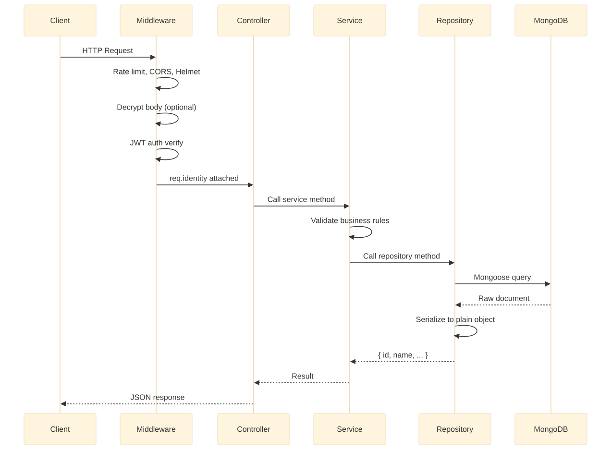

# <%= projectName %> — API

Node.js/Express REST API for **<%= projectName %>** with MongoDB, JWT auth, hybrid encryption, Socket.IO real-time events, Stripe subscriptions, invoice PDFs, and the **Repository Pattern** for database abstraction.

## Quick Start

```bash
cp .env.example .env
npm install
npm run dev
```

The server runs on the port defined in `.env` (`PORT`, default `3000`) and connects to MongoDB using `MONGODB_URI` (or the individual `DB_*` variables).

## Scripts

| Command | Description |
|---------|-------------|
| `npm run dev` | Start the API with nodemon (auto-reload) |
| `npm start` | Start the API in production |

> `eslint.config.js` and `.prettierrc` are included — run your editor/CI linter of choice.

## PM2 Deployment

```bash
pm2 start ecosystem.config.js
pm2 save
pm2 startup
```

## Environment Variables

| Variable | Description |
|----------|-------------|
| `NODE_ENV` | `development` / `production` (disables rate limiting in dev) |
| `PROJECT_NAME` | Display name of the project |
| `PORT` | HTTP port (default `3000`) |
| `MONGODB_URI` | Full Mongo connection string — overrides `DB_*` when set |
| `DB_USER` / `DB_PASSWORD` / `HOST` / `DB_PORT` / `DB_NAME` | MongoDB connection parts (fallback when `MONGODB_URI` is unset) |
| `JWT_SECRET` | Secret used to sign JWTs |
| `JWT_EXPIRES_IN` | Token lifetime (default `7d`) |
| `CRYPTO_SECURE_ENCRYPTION` | `true` = crypto-secure (ECDH/RSA + AES-GCM), `false` = legacy AES-CBC |
| `CRYPTO_SECURE_PRIVATE_KEY` / `CRYPTO_SECURE_PUBLIC_KEY` | RSA/ECDH keypair (auto-generated on first run when crypto-secure is on) |
| `SECRET_KEY` / `ENCRYPTION_IV` | Legacy AES-CBC keys (used when `CRYPTO_SECURE_ENCRYPTION=false`) |
| `SMTP_HOST` / `SMTP_PORT` / `SMTP_USER` / `SMTP_PASS` | Nodemailer SMTP config |
| `EMAIL_FROM` / `ADMINEMAIL` | Email from/admin addresses |
| `FRONT_WEB_URL` / `FRONTEND_URL` / `BACK_WEB_URL` | URLs used inside emails and links |
| `RUN_SEED` | `true` seeds default roles + admin user on startup |
| `SEED_ADMIN_EMAIL` / `SEED_ADMIN_PASSWORD` | Seeded admin credentials |
| `STRIPE_SECRET_KEY` / `STRIPE_WEBHOOK_SECRET` | Stripe keys for subscriptions |
| `CORS_ORIGIN` | Allowed origins (comma-separated). If unset, cross-origin requests are denied |

## Encryption Modes

| Mode | Algorithm | Key source |
|------|-----------|-----------|
| **crypto-secure** (`CRYPTO_SECURE_ENCRYPTION=true`) | ECDH P-256 + AES-256-GCM (RSA-2048 OAEP fallback) | Auto-generated keys written to `.env` on first run |
| **Legacy** (`CRYPTO_SECURE_ENCRYPTION=false`) | AES-CBC (node-forge) | `SECRET_KEY` + `ENCRYPTION_IV` |

The server exposes:
- `GET /.well-known/encryption-key` — public key for crypto-secure clients
- `GET /settings/crypto` — crypto mode + keys fetched by the frontend/admin at runtime

## API Response Format

Every endpoint returns one normalized envelope:

```json
// success — single resource
{ "success": true, "code": 200, "message": "…", "data": { } }

// success — list
{ "success": true, "code": 200, "message": "…", "data": { "list": [], "total": 0, "page": 1, "count": 10 } }

// success — void / mutation
{ "success": true, "code": 200, "message": "…", "data": null }

// error
{ "success": false, "code": 400, "message": "…", "error": { "code": 400, "message": "…" }, "data": null }
```

When encryption is enabled, the `data` value is encrypted and clients decrypt it transparently via the axios interceptors.

---

## Architecture — Repository Pattern

All database logic is isolated behind a **repository layer**. Services never touch ORMs or queries directly. Every repository method returns a **plain JavaScript object** with string IDs — never a Mongoose document.

```js
// Repository output — always a plain object
{ id: "abc123", name: "admin", status: "active" }
```

### Architecture Overview



### Request Flow



### Services & Repositories Map

| Service | Repository | Model |
|---------|-----------|-------|
| `userService.js` | `userRepository.js` | `User.js` |
| `roleService.js` | `roleRepository.js` | `Role.js` |
| `categoryService.js` | `categoryRepository.js` | `category.model.js` |
| `feedbackService.js` | `feedbackRepository.js` | `Feedback.model.js` |
| `contentManagementService.js` | `contentManagementRepository.js` | `contentManagement.model.js` |
| `featureService.js` | `featureRepository.js` | `featureModel.js` |
| `planService.js` | `planRepository.js` | `planModel.js` |
| `subscriptionService.js` | `subscriptionRepository.js` | `subscriptionModel.js` |
| `transactionService.js` | `transactionRepository.js` | `transactionModel.js` |
| `notificationService.js` | `notificationRepository.js` | `notification.model.js` |

### Adding a New Database Tomorrow

The repository pattern makes polyglot persistence additive, not invasive.

#### Scenario: Add PostgreSQL for Orders

1. Create `models/postgres/Order.js` — Sequelize model
2. Create `repositories/orderRepository.js` — wraps Sequelize queries
3. Export it from `repositories/index.js`
4. Services import `orderRepo` and use it — zero impact on existing MongoDB code

The existing 10 MongoDB-based services don't change at all.

#### Scenario: Migrate Users from MongoDB to PostgreSQL

Change **1 file** — `repositories/userRepository.js`:

```js
exports.findByEmail = async (email) => {
  if (config.USE_PG_FOR_USERS) {
    return pgUserRepo.findByEmail(email);  // Sequelize query
  }
  return mongoUserRepo.findByEmail(email); // Mongoose query
};
```

All 12 services that call `userRepo.findByEmail()` continue working unchanged.

### Repository Pattern Rules

1. **Methods return plain objects** — `{ id: string, ... }`, never Mongoose documents
2. **null for not-found** — never throw from a repo; let the service decide
3. **lean() on all queries** — no Mongoose document overhead
4. **All ORM-specific syntax inside repos** — `$lookup`, `$match`, `.populate()` never leak to services
5. **Services do business logic** — validation, authorization, email sending, cross-repo orchestration

### Directory Structure

```
src/
├── app.js                             # Express app setup, DB init, Socket.IO
├── config/
│   └── db.config.js                   # MongoDB URI builder
├── controllers/                       # Route handlers (thin wrappers)
│   ├── userController.js
│   ├── roleController.js
│   ├── categoryController.js
│   ├── feedbackController.js
│   ├── contentManagementController.js
│   ├── featureController.js
│   ├── planController.js
│   ├── subscriptionController.js
│   ├── notificationController.js
│   ├── transactionController.js
│   ├── uploadController.js
│   └── ...
├── Emails/                            # Nodemailer SMTP + templates
├── middleware/                        # Auth, decrypt, error handler
├── models/                            # Mongoose schemas
│   ├── index.js                       # Model registry
│   ├── User.js
│   ├── Role.js
│   ├── category.model.js
│   └── ...
├── repositories/                      # ★ DATABASE LAYER ★
│   ├── repositoryUtils.js             # Shared serialize, paginate, helpers
│   ├── index.js                       # Barrel export
│   └── ... (one per domain)
├── routes/
│   ├── index.js                       # Route aggregator
│   ├── userRoutes.js
│   ├── roleRoutes.js
│   └── ...
├── services/                          # ★ BUSINESS LOGIC ★ (calls repos only)
│   ├── userService.js
│   ├── roleService.js
│   ├── ... (one per domain)
│   ├── socket.js                      # Socket.IO events
│   └── subscriptionCron.js            # Scheduled subscription jobs
├── utils/
│   ├── constants.js
│   ├── helpers.js
│   ├── paginate.js
│   ├── response.js                    # Normalized response helper
│   └── invoices.js
├── validations/                       # Joi schemas
└── views/                             # Static HTML
```

---

## User API

All endpoints are prefixed with `/users`.  
Requests are decrypted by middleware — send payload inside `{ data: "<encrypted-hex>" }` when encryption is enabled.

### Auth

| Method | Path | Auth | Description |
|--------|------|------|-------------|
| POST | `/users/register` | No | Register a new user |
| POST | `/users/signup` | No | Register via mobile app |
| POST | `/users/login` | No | User login |
| POST | `/users/app-login` | No | Mobile app login |
| POST | `/users/auto-login` | Yes | Auto-login from token |
| POST | `/users/admin/login` | No | Admin login |
| POST | `/users/logout` | Yes | Logout |

**POST `/users/register`**

```json
{ "firstName": "John", "lastName": "Doe", "email": "john@example.com", "password": "secret123", "mobileno": "", "dob": "", "role": "" }
```

**POST `/users/login`**

```json
{ "email": "john@example.com", "password": "secret123", "device_token": "", "currentLocation": { "coordinates": [0, 0] } }
```

### Profile

| Method | Path | Auth | Description |
|--------|------|------|-------------|
| GET | `/users/profile` | Yes | Get own profile |
| PUT | `/users/edit-profile` | Yes | Update profile |

**PUT `/users/edit-profile`**

```json
{ "firstName": "John", "lastName": "Smith", "mobileno": "1234567890", "image": "", "address": "123 Main St", "city": "NYC", "state": "NY", "country": "US", "pinCode": "10001", "bio": "", "dob": "1990-01-01", "gender": "male" }
```

### Password

| Method | Path | Auth | Description |
|--------|------|------|-------------|
| PUT | `/users/change-password` | Yes | Change password (requires current password) |
| PUT | `/users/reset-password` | No | Reset password with OTP |
| POST | `/users/set-password` | No | Set initial password |

**PUT `/users/change-password`**

```json
{ "currentPassword": "old123", "newPassword": "new456" }
```

**PUT `/users/reset-password`**

```json
{ "email": "john@example.com", "password": "new456", "otp": "123456" }
```

### Forgot Password

| Method | Path | Auth | Description |
|--------|------|------|-------------|
| POST | `/users/forgot-password` | No | Send OTP email to user |
| POST | `/users/admin/forgot-password` | No | Send reset link to admin |

### Email Verification

| Method | Path | Auth | Description |
|--------|------|------|-------------|
| GET | `/users/verify` | No | Verify email via link (redirects to frontend) |
| POST | `/users/verify-otp` | No | Verify with OTP code |
| PUT | `/users/resend-otp` | No | Resend verification OTP |

**POST `/users/verify-otp`**

```json
{ "email": "john@example.com", "otp": "123456" }
```

### Admin — User Management

| Method | Path | Auth | Description |
|--------|------|------|-------------|
| POST | `/users/add` | Yes | Admin adds a new user |
| GET | `/users/list` | Yes | List all users (paginated, filterable) |
| PUT | `/users/change-status` | Yes | Activate / deactivate user |
| PUT | `/users/change-approval-status` | Yes | Approve / reject user |
| DELETE | `/users/delete` | Yes | Soft-delete user |

**GET `/users/list`**

Query params: `page`, `limit`, `search`, `startDate`, `endDate`, `role`, `status`, `approvalStatus`, `isVerified`

**POST `/users/add`**

```json
{ "firstName": "Jane", "lastName": "Doe", "email": "jane@example.com", "role": "ROLE_ID", "password": "temp123", "mobileno": "", "address": "", "city": "", "state": "", "country": "" }
```

**PUT `/users/change-status`**

```json
{ "id": "USER_ID", "status": "active" }
```

**PUT `/users/change-approval-status`**

```json
{ "id": "USER_ID", "approvalStatus": "approved", "rejectedReason": "" }
```

**DELETE `/users/delete`**

```json
{ "id": "USER_ID" }
```

---

## Role API

All endpoints are prefixed with `/roles`. All role routes require authentication.

| Method | Path | Auth | Description |
|--------|------|------|-------------|
| POST | `/roles/add` | Yes | Create a new role |
| GET | `/roles/detail` | Yes | Get role details by ID |
| PUT | `/roles/update` | Yes | Update role |
| GET | `/roles/listing` | Yes | List all roles (paginated) |
| PUT | `/roles/status/change` | Yes | Activate / deactivate role |
| DELETE | `/roles/delete` | Yes | Soft-delete role |
| GET | `/roles/frontend-list` | Yes | List active roles for dropdowns |

**POST `/roles/add`**

```json
{ "name": "editor", "displayName": "Editor", "description": "Can edit content", "permissions": ["read", "write"] }
```

**GET `/roles/detail`**

Query param: `id=ROLE_ID`

**PUT `/roles/update`**

```json
{ "id": "ROLE_ID", "name": "editor", "displayName": "Editor", "description": "Updated description", "permissions": ["read", "write", "delete"] }
```

**GET `/roles/listing`**

Query params: `page`, `limit`, `search`, `startDate`, `endDate`

**PUT `/roles/status/change`**

```json
{ "id": "ROLE_ID", "status": "deactive" }
```

**DELETE `/roles/delete`**

```json
{ "id": "ROLE_ID" }
```

---

## Category API

All endpoints are prefixed with `/category`.

| Method | Path | Auth | Description |
|--------|------|------|-------------|
| POST | `/category/add` | Yes | Create a category |
| GET | `/category/detail` | Yes | Get category by ID |
| PUT | `/category/update` | Yes | Update category |
| DELETE | `/category/delete` | Yes | Delete category |
| GET | `/category/listing` | Yes | List categories (paginated) |
| PUT | `/category/status/change` | Yes | Activate / deactivate |
| GET | `/category/sub/listing` | Yes | List sub-categories |

---

## Feedback API

All endpoints are prefixed with `/feedback`.

| Method | Path | Auth | Description |
|--------|------|------|-------------|
| POST | `/feedback/add` | No | Submit feedback / contact form |
| GET | `/feedback/detail` | Yes | Get feedback by ID |
| PUT | `/feedback/update` | Yes | Update feedback |
| DELETE | `/feedback/delete` | Yes | Soft-delete feedback |
| GET | `/feedback/listing` | Yes | List feedback (paginated, filterable) |
| PUT | `/feedback/status/change` | Yes | Change status (new/read/resolved) |
| POST | `/feedback/reply` | Yes | Admin reply to feedback |

**GET `/feedback/listing`**

Query params: `page`, `count`, `search`, `status`, `topic`, `email`

**POST `/feedback/add`**

```json
{ "firstName": "John", "lastName": "Doe", "email": "john@example.com", "topic": "Bug report", "message": "I found a bug..." }
```

**POST `/feedback/reply`**

```json
{ "id": "FEEDBACK_ID", "message": "Thanks for reporting, we're on it!" }
```

---

## Content Management API

All endpoints are prefixed with `/content-management`.

| Method | Path | Auth | Description |
|--------|------|------|-------------|
| POST | `/content-management/add` | Yes | Create content |
| GET | `/content-management/detail` | Yes | Get content by ID/slug |
| PUT | `/content-management/update` | Yes | Update content |
| GET | `/content-management/listing` | Yes | List content |
| PUT | `/content-management/status/change` | Yes | Activate / deactivate |
| DELETE | `/content-management/delete` | Yes | Soft-delete content |

---

## Feature API

All endpoints are prefixed with `/features`.

| Method | Path | Auth | Description |
|--------|------|------|-------------|
| POST | `/features/add` | Yes | Create a feature |
| PUT | `/features/update` | Yes | Update a feature |
| PUT | `/features/status/change` | Yes | Activate / deactivate |
| GET | `/features/list` | Yes | List features |
| GET | `/features/detail` | Yes | Get feature by ID |
| DELETE | `/features/delete` | Yes | Delete a feature |

---

## Plan API

All endpoints are prefixed with `/plans`.

| Method | Path | Auth | Description |
|--------|------|------|-------------|
| POST | `/plans/add` | Yes | Create a plan |
| PUT | `/plans/update` | Yes | Update a plan |
| PUT | `/plans/status/change` | Yes | Activate / deactivate |
| GET | `/plans/list` | Yes | List plans |
| GET | `/plans/detail` | Yes | Get plan by ID |
| DELETE | `/plans/delete` | Yes | Delete a plan |

---

## Subscription API

| Method | Path | Auth | Description |
|--------|------|------|-------------|
| POST | `/subscriptions/purchase` | Yes | Create Stripe checkout session |
| DELETE | `/subscriptions/cancel` | Yes | Cancel subscription |
| GET | `/subscriptions/detail` | Yes | Get own subscription |
| GET | `/subscriptions/list` | Yes | List subscriptions |
| GET | `/subscriptions/customerbalance` | Yes | Retrieve Stripe customer balance |
| POST | `/subscriptions/webhook` | No | Stripe webhook (raw body, signature verified) |

### Subscription Webhook

Stripe sends `checkout.session.completed` events to `/subscriptions/webhook`. The webhook:

1. Verifies the Stripe signature via `STRIPE_WEBHOOK_SECRET`
2. Checks idempotency via `stripe_session_id`
3. Looks up the plan and subscriber (user or organization)
4. Cancels any existing active subscriptions
5. Creates/updates the subscription record
6. Updates the subscriber's `planId` / `subscriptionId`
7. Fires background tasks: invoice PDF generation, email receipt, notifications

---

## Notification API

All endpoints are prefixed with `/notifications`. Requires authentication.

| Method | Path | Auth | Description |
|--------|------|------|-------------|
| GET | `/notifications/list` | Yes | List own notifications (paginated, filterable) |
| PUT | `/notifications/read` | Yes | Mark single notification as read |
| PUT | `/notifications/read-all` | Yes | Mark all notifications as read |
| PUT | `/notifications/dismiss` | Yes | Dismiss a notification |
| GET | `/notifications/unread-count` | Yes | Get unread notification count |
| POST | `/notifications/broadcast` | Admin | Send notification to all active users |

**GET `/notifications/list`**

Query params: `page`, `count`, `type`, `read`

**PUT `/notifications/read`**

```json
{ "id": "NOTIFICATION_ID" }
```

**PUT `/notifications/dismiss`**

```json
{ "id": "NOTIFICATION_ID" }
```

---

## Transaction API

All endpoints are prefixed with `/transactions`. Requires authentication.

| Method | Path | Auth | Description |
|--------|------|------|-------------|
| GET | `/transactions/listing` | Yes | List all transactions (paginated) |
| POST | `/transactions/send-invoice` | Yes | Generate & email invoice PDF for a transaction |
| GET | `/transactions/download` | Yes | Download invoice PDF for a transaction |

**GET `/transactions/listing`**

Query params: `page`, `count`, `sortBy`, `userId`, `search`, `status`

**POST `/transactions/send-invoice`**

```json
{ "id": "TRANSACTION_ID" }
```

**GET `/transactions/download`**

Query param: `id=TRANSACTION_ID`

---

## FAQ API

All endpoints are prefixed with `/faqs`.

| Method | Path | Auth | Description |
|--------|------|------|-------------|
| GET | `/faqs/list` | No | Public FAQ listing |
| GET | `/faqs/categories` | No | FAQ categories |
| POST | `/faqs/add` | Admin | Create FAQ |
| GET | `/faqs/detail` | Admin | Get FAQ by ID |
| PUT | `/faqs/update` | Admin | Update FAQ |
| DELETE | `/faqs/delete` | Admin | Delete FAQ |
| GET | `/faqs/listing` | Admin | Admin listing |
| PUT | `/faqs/status/change` | Admin | Activate / deactivate |

---

## Settings API

| Method | Path | Auth | Description |
|--------|------|------|-------------|
| GET | `/settings` | Admin | Get full settings (config, site, SMTP, security) |
| GET | `/settings/public` | No | Public site settings (social links, support email, ...) |
| GET | `/settings/crypto` | No | Crypto config fetched by frontend/admin clients |
| PUT | `/settings` | Admin | Update settings |

---

## Upload API

All endpoints are prefixed with `/upload`. Files are stored under `public/`.

| Method | Path | Description |
|--------|------|-------------|
| POST | `/upload/image` | Upload single image (multipart `file`, ≤5MB) |
| POST | `/upload/image-base64` | Upload base64 image |
| POST | `/upload/document` | Upload single document (≤5MB) |
| POST | `/upload/multiple-images` | Upload multiple images |
| POST | `/upload/video` | Upload video (≤5MB) |
| POST | `/upload/audio` | Upload audio (≤5MB) |
| POST | `/upload/multiple/documents` | Upload multiple documents (≤10MB each) |

---

## Dashboard API

| Method | Path | Auth | Description |
|--------|------|------|-------------|
| GET | `/admin-dashboard/stats` | Admin | Aggregated dashboard stats |

---

## Socket.IO Events

Clients connect with a JWT (`socket.handshake.auth.token`) and join a per-user room.

| Event | Direction | Payload |
|-------|-----------|---------|
| `user_online` | Server → peers | `{ userId }` |
| `user_offline` | Server → peers | `{ userId }` |
| `users_online` | Server → peers | `[userId, ...]` |
| `user_status_change` | Client → server / Server → peers | `{ userId, status }` |
| `chat_join` / `chat_leave` | Client → server | `{ id }` (conversation id) |
| `chat_typing` / `chat_stop_typing` | Client → server / room | `{ userId, conversationId }` |
| `chat_send_message` | Client → server / room | `{ userId, conversationId, message, attachments, timestamp }` |
| `chat_new_message` | Server → room | Message object |
| `chat_message_delivered` / `chat_message_read` | Client → room | `{ userId, conversationId, messageId }` |
| `chat_mark_read` | Client → room | `{ userId, conversationId }` |
| `chat_edit_message` / `chat_delete_message` | Client → room | Message edit/delete payload |
| `send_notification` | Client → server | `{ targetUserId, event, data }` |
| `notification_read` / `notification_dismiss` | Client → server / user room | `{ userId, notificationId }` |

---

## Error Handling

All errors return JSON with the following structure:

```json
{
  "success": false,
  "code": 400,
  "message": "Error description",
  "error": { "code": 400, "message": "Error description" },
  "data": null
}
```

## Postman Collection

Import the collection from `postman/collection.json` (if available).