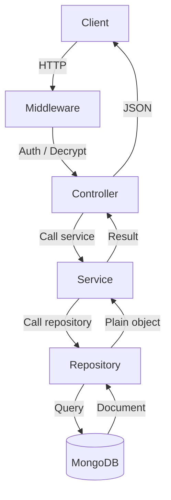
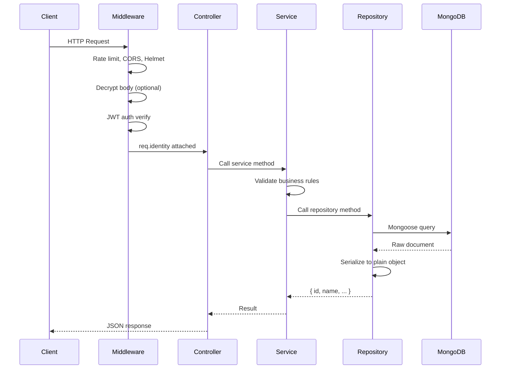
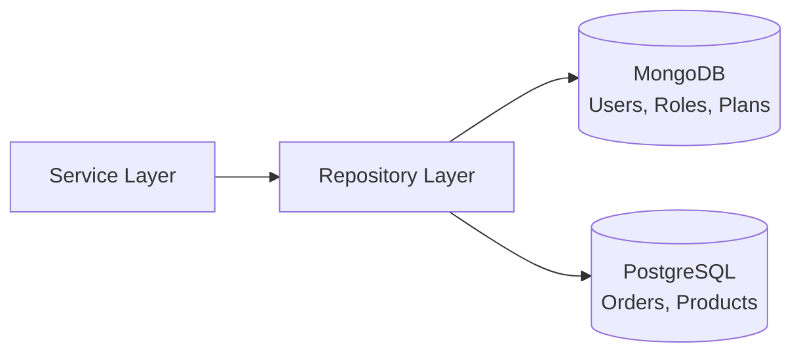

# <%= projectName %>

Node.js/Express REST API with MongoDB, JWT auth, encryption, and **Repository Pattern** for database abstraction.

## Quick Start

```bash
cp .env.example .env
npm install
npm run dev
```

## Scripts

| Command | Description |
|---------|-------------|
| `npm run dev` | Start dev server with nodemon |
| `npm start` | Start production server |
| `npm run lint` | Run ESLint |
| `npm run format` | Run Prettier |

## PM2 Deployment

```bash
pm2 start ecosystem.config.js
pm2 save
pm2 startup
```

---

## Architecture — Repository Pattern

All database logic is isolated behind a **repository layer**. Services never touch ORMs or queries directly. Every repository method returns a **plain JavaScript object** with string IDs — never a Mongoose document.

```js
// Repository output — always a plain object
{ id: "abc123", name: "admin", status: "active" }
```

### Architecture Overview



### Request Flow



### Services & Repositories Map

| Service | Repository | Model |
|---------|-----------|-------|
| `userService.js` | `userRepository.js` | `User.js` |
| `roleService.js` | `roleRepository.js` | `Role.js` |
| `categoryService.js` | `categoryRepository.js` | `category.model.js` |
| `contactUsService.js` | `contactUsRepository.js` | `ContactUs.model.js` |
| `contentManagementService.js` | `contentManagementRepository.js` | `contentManagement.model.js` |
| `featureService.js` | `featureRepository.js` | `featureModel.js` |
| `planService.js` | `planRepository.js` | `planModel.js` |
| `subscriptionService.js` | `subscriptionRepository.js` | `subscriptionModel.js` |
| `transactionService.js` | `transactionRepository.js` | `transactionModel.js` |
| `notificationService.js` | `notificationRepository.js` | `notification.model.js` |

### Adding a New Database Tomorrow

The repository pattern makes polyglot persistence additive, not invasive.

#### Scenario: Add PostgreSQL for Orders



1. Create `models/postgres/Order.js` — Sequelize model
2. Create `repositories/orderRepository.js` — wraps Sequelize queries
3. Export it from `repositories/index.js`
4. Services import `orderRepo` and use it — zero impact on existing MongoDB code

The existing 10 MongoDB-based services don't change at all.

#### Scenario: Migrate Users from MongoDB to PostgreSQL

Change **1 file** — `repositories/userRepository.js`:

```js
exports.findByEmail = async (email) => {
  if (config.USE_PG_FOR_USERS) {
    return pgUserRepo.findByEmail(email);  // Sequelize query
  }
  return mongoUserRepo.findByEmail(email); // Mongoose query
};
```

All 12 services that call `userRepo.findByEmail()` continue working unchanged.

### Repository Pattern Rules

1. **Methods return plain objects** — `{ id: string, ... }`, never Mongoose documents
2. **null for not-found** — never throw from a repo; let the service decide
3. **lean() on all queries** — no Mongoose document overhead
4. **All ORM-specific syntax inside repos** — `$lookup`, `$match`, `.populate()` never leak to services
5. **Services do business logic** — validation, authorization, email sending, cross-repo orchestration

### Directory Structure

```
src/
├── app.js                             # Express app setup, DB init
├── config/
│   └── db.config.js                   # MongoDB URI builder
├── controllers/                       # Route handlers (thin wrappers)
│   ├── userController.js
│   ├── roleController.js
│   ├── categoryController.js
│   ├── contactUsController.js
│   ├── contentManagementController.js
│   ├── featureController.js
│   ├── planController.js
│   ├── subscriptionController.js
│   ├── notificationController.js
│   ├── transactionController.js
│   ├── uploadController.js
│   └── ...
├── Emails/                            # Nodemailer SMTP + templates
├── middleware/                         # Auth, decrypt, error handler
├── models/                            # Mongoose schemas
│   ├── index.js                       # Model registry
│   ├── User.js
│   ├── Role.js
│   ├── category.model.js
│   └── ...
├── repositories/                      # ★ DATABASE LAYER ★
│   ├── repositoryUtils.js             # Shared serialize, paginate, helpers
│   ├── index.js                       # Barrel export
│   ├── userRepository.js
│   ├── roleRepository.js
│   ├── categoryRepository.js
│   ├── contactUsRepository.js
│   ├── contentManagementRepository.js
│   ├── featureRepository.js
│   ├── planRepository.js
│   ├── subscriptionRepository.js
│   ├── transactionRepository.js
│   └── notificationRepository.js
├── routes/
│   ├── index.js                       # Route aggregator
│   ├── userRoutes.js
│   ├── roleRoutes.js
│   └── ...
├── services/                          # ★ BUSINESS LOGIC ★ (calls repos only)
│   ├── userService.js
│   ├── roleService.js
│   ├── categoryService.js
│   ├── contactUsService.js
│   ├── contentManagementService.js
│   ├── featureService.js
│   ├── planService.js
│   ├── subscriptionService.js
│   ├── transactionService.js
│   ├── notificationService.js
│   ├── uploadService.js
│   └── socket.js
├── utils/
│   ├── constants.js
│   ├── helpers.js
│   ├── paginate.js
│   ├── response.js
│   └── invoices.js
├── validations/                       # Joi schemas
└── views/                             # Static HTML
```

---

## User API

All endpoints are prefixed with `/users`.  
Requests are decrypted by middleware — send payload inside `{ data: "<encrypted-hex>" }`.

### Auth

| Method | Path | Auth | Description |
|--------|------|------|-------------|
| POST | `/users/register` | No | Register a new user |
| POST | `/users/signup` | No | Register via mobile app |
| POST | `/users/login` | No | User login |
| POST | `/users/app-login` | No | Mobile app login |
| POST | `/users/auto-login` | Yes | Auto-login from token |
| POST | `/users/admin/login` | No | Admin login |
| POST | `/users/logout` | Yes | Logout |

**POST `/users/register`**

```json
{ "firstName": "John", "lastName": "Doe", "email": "john@example.com", "password": "secret123", "mobileno": "", "dob": "", "role": "" }
```

**POST `/users/login`**

```json
{ "email": "john@example.com", "password": "secret123", "device_token": "", "currentLocation": { "coordinates": [0, 0] } }
```

### Profile

| Method | Path | Auth | Description |
|--------|------|------|-------------|
| GET | `/users/profile` | Yes | Get own profile |
| PUT | `/users/edit-profile` | Yes | Update profile |

**PUT `/users/edit-profile`**

```json
{ "firstName": "John", "lastName": "Smith", "mobileno": "1234567890", "image": "", "address": "123 Main St", "city": "NYC", "state": "NY", "country": "US", "pinCode": "10001", "bio": "", "dob": "1990-01-01", "gender": "male" }
```

### Password

| Method | Path | Auth | Description |
|--------|------|------|-------------|
| PUT | `/users/change-password` | Yes | Change password (requires current password) |
| PUT | `/users/reset-password` | No | Reset password with OTP |
| POST | `/users/set-password` | No | Set initial password |

**PUT `/users/change-password`**

```json
{ "currentPassword": "old123", "newPassword": "new456" }
```

**PUT `/users/reset-password`**

```json
{ "email": "john@example.com", "password": "new456", "otp": "123456" }
```

### Forgot Password

| Method | Path | Auth | Description |
|--------|------|------|-------------|
| POST | `/users/forgot-password` | No | Send OTP email to user |
| POST | `/users/admin/forgot-password` | No | Send reset link to admin |

### Email Verification

| Method | Path | Auth | Description |
|--------|------|------|-------------|
| GET | `/users/verify` | No | Verify email via link (redirects to frontend) |
| POST | `/users/verify-otp` | No | Verify with OTP code |
| PUT | `/users/resend-otp` | No | Resend verification OTP |

**POST `/users/verify-otp`**

```json
{ "email": "john@example.com", "otp": "123456" }
```

### Admin — User Management

| Method | Path | Auth | Description |
|--------|------|------|-------------|
| POST | `/users/add` | Yes | Admin adds a new user |
| GET | `/users/list` | Yes | List all users (paginated, filterable) |
| PUT | `/users/change-status` | Yes | Activate / deactivate user |
| PUT | `/users/change-approval-status` | Yes | Approve / reject user |
| DELETE | `/users/delete` | Yes | Soft-delete user |

**GET `/users/list`**  

Query params: `page`, `limit`, `search`, `startDate`, `endDate`, `role`, `status`, `approvalStatus`, `isVerified`

**POST `/users/add`**

```json
{ "firstName": "Jane", "lastName": "Doe", "email": "jane@example.com", "role": "ROLE_ID", "password": "temp123", "mobileno": "", "address": "", "city": "", "state": "", "country": "" }
```

**PUT `/users/change-status`**

```json
{ "id": "USER_ID", "status": "active" }
```

**PUT `/users/change-approval-status`**

```json
{ "id": "USER_ID", "approvalStatus": "approved", "rejectedReason": "" }
```

**DELETE `/users/delete`**

```json
{ "id": "USER_ID" }
```

---

## Role API

All endpoints are prefixed with `/roles`. All role routes require authentication.

| Method | Path | Auth | Description |
|--------|------|------|-------------|
| POST | `/roles/add` | Yes | Create a new role |
| GET | `/roles/detail` | Yes | Get role details by ID |
| PUT | `/roles/update` | Yes | Update role |
| GET | `/roles/listing` | Yes | List all roles (paginated) |
| PUT | `/roles/status/change` | Yes | Activate / deactivate role |
| DELETE | `/roles/delete` | Yes | Soft-delete role |
| GET | `/roles/frontend-list` | Yes | List active roles for dropdowns |

**POST `/roles/add`**

```json
{ "name": "editor", "displayName": "Editor", "description": "Can edit content", "permissions": ["read", "write"] }
```

**GET `/roles/detail`**

Query param: `id=ROLE_ID`

**PUT `/roles/update`**

```json
{ "id": "ROLE_ID", "name": "editor", "displayName": "Editor", "description": "Updated description", "permissions": ["read", "write", "delete"] }
```

**GET `/roles/listing`**

Query params: `page`, `limit`, `search`, `startDate`, `endDate`

**PUT `/roles/status/change`**

```json
{ "id": "ROLE_ID", "status": "deactive" }
```

**DELETE `/roles/delete`**

```json
{ "id": "ROLE_ID" }
```

---

## Notification API

All endpoints are prefixed with `/notifications`. Requires authentication.

| Method | Path | Auth | Description |
|--------|------|------|-------------|
| GET | `/notifications/list` | Yes | List own notifications (paginated, filterable) |
| PUT | `/notifications/read` | Yes | Mark single notification as read |
| PUT | `/notifications/read-all` | Yes | Mark all notifications as read |
| PUT | `/notifications/dismiss` | Yes | Dismiss a notification |
| GET | `/notifications/unread-count` | Yes | Get unread notification count |
| POST | `/notifications/broadcast` | Admin | Send notification to all active users |

**GET `/notifications/list`**

Query params: `page`, `count`, `type`, `read`

**PUT `/notifications/read`**

```json
{ "id": "NOTIFICATION_ID" }
```

**PUT `/notifications/dismiss`**

```json
{ "id": "NOTIFICATION_ID" }
```

### Socket Events

When a notification is created, the server emits:

| Event | Direction | Payload |
|-------|-----------|---------|
| `new_notification` | Server → User | Full notification object |
| `notification_read` | Server → User | `{ userId, notificationId }` |
| `notifications_all_read` | Server → User | `{ userId }` |
| `notification_dismissed` | Server → User | `{ userId, notificationId }` |

---

## Transaction API

All endpoints are prefixed with `/transactions`. Requires authentication.

| Method | Path | Auth | Description |
|--------|------|------|-------------|
| GET | `/transactions/listing` | Yes | List all transactions (paginated) |
| POST | `/transactions/send-invoice` | Yes | Generate & email invoice PDF for a transaction |
| GET | `/transactions/download` | Yes | Download invoice PDF for a transaction |

**GET `/transactions/listing`**

Query params: `page`, `count`, `sortBy`, `userId`, `search`, `status`

**POST `/transactions/send-invoice`**

```json
{ "id": "TRANSACTION_ID" }
```

**GET `/transactions/download`**

Query param: `id=TRANSACTION_ID`

---

## Subscription Webhook

| Method | Path | Description |
|--------|------|-------------|
| POST | `/subscriptions/webhook` | Stripe webhook (raw body, signature verified) |

Stripe sends `checkout.session.completed` events to this endpoint. The webhook:

1. Verifies the Stripe signature via `STRIPE_WEBHOOK_SECRET`
2. Checks idempotency via `stripe_session_id`
3. Looks up the plan and subscriber (user or organization)
4. Cancels any existing active subscriptions
5. Creates/updates the subscription record
6. Updates the subscriber's `planId` / `subscriptionId`
7. Fires background tasks: invoice PDF generation, email receipt, notifications

---

## Error Handling

All errors return JSON with the following structure:

```json
{
  "success": false,
  "message": "Error description",
  "data": null
}
```

## Postman Collection

Import the collection from `postman/collection.json` (if available).
